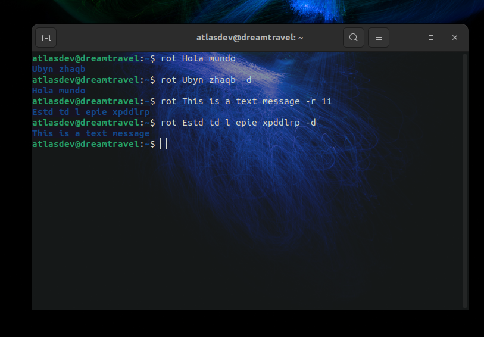

---

<h1>cryptorot 🔒</h1>

## Descripción 📝

<b>CryptoRot</b> es una herramienta diseñada para utilizar el algoritmo de <i>cifrado de rotación simétrico</i>, lo cual permite ocultar oraciones con gran facilidad con un <i>simple algoritmo</i>. Usando un simple comando, se puede cifrar un texto de manera <b>fácil y rápida</b>, lo que lo convierte en una herramienta muy útil y simple de usar para personas con poca experiencia en criptografía.

## Objetivos 🎯

* Crear, de manera fácil, óptima y accesible, una herramienta que permita cifrar y descifrar un conjunto de texto a través de una clave, aplicando un algoritmo de rotación utilizando una clave.
* Facilitar su uso a través de una interfaz de línea de comandos (CLI), buscando potenciar la multifuncionalidad versátil en la terminal de quien la use.

## Funcionalidades 💡

CryptoRot tiene la capacidad de brindar una manera versátil de convertir texto legible, en un conjunto de caracteres, donde su única relación entre ambos es el algoritmo de rotación aplicando la llave de cifrado que el usuario puede establecer, donde esa llave será la que permitirá cifrar y descifrar, para más información <a href="https://es.wikipedia.org/wiki/ROT13">puedes leer acá</a>.
- Interactuar con el usuario a través de <b>la terminal</b>.
- <b>Rapidez y versatilidad</b> con un algoritmo optimizado para ello. 
- La capacidad de almacenar en un <i>archivo de configuración</i> la llave que se usará, lo que permite no establecerla cada vez que se usará.
- <b>Descifrar</b> con un simple parámetro.
- Control de lenguaje para su comprensión en <b>varios idiomas</b>.
- <b>Simplicidad:</b> El sistema usa una sola función para cifrar y descifrar, lo que permite ser reutilizada para desarrolladores que buscan <i>desarrollar implementaciones</i>.

## Requisitos 🛠️

- <code>json</code> Librería para la interacción de archivos con formato JSON.

## Instalación 💻

Para instalar correctamente el bot, sigue los siguientes pasos:

1) Clonar este repositorio:
    - <code>git clone https://github.com/TechAtlasDev/cryptorot</code>

 

2) Entrar al directorio:
    - cd cryptorot

 

3) Instalar python si no lo tienes instalado:
    - Para Ubuntu: <code>sudo apt install python3 -y</code>
    - Para Termux: <code>apt install python3 -y</code>

 

4) Instalar las dependencias y configurar el sistema:
    - El setup es tan simple como poner el siguiente comando: <code>bash setup.sh</code>
    - Finalmente, darle permisos al ejecutable de ser utilizado: <code>chmod 776 src/rot</code>

 

5) Usar el sistema!:
    - Puedes iniciar con el comando <code>rot</code> lo que te permitirá obtener ejemplos de uso y parámetros disponibles.

## Compatibilidad 🔨

|   Entorno   | Es compatible | Probado en |
|:------------:|:------------:|:------------:|
|   Windows   |   ❌   |   ❌   |
|   Linux     |   ✅   |   ✅   |
|   Termux    |   ✅   |   ✅   |

## Idiomas 🗣️

|   Idioma   | Disponibilidad |
|:------------:|:------------:|
|   Español   |   ✅   |
|   Ingles     |   ✅   |

## Screenshot 📸
